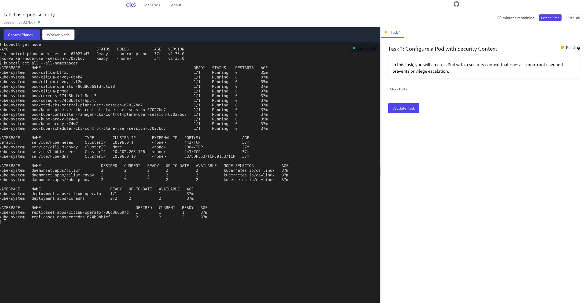

# CKS Practice Environment

A self-hosted practice environment for the Certified Kubernetes Security Specialist (CKS) exam, utilizing KubeVirt for virtualization.



## Overview

This project provides an interactive, hands-on practice environment for CKS certification preparation. It creates isolated Kubernetes clusters using KubeVirt, allowing users to practice security techniques in a sandbox environment that closely resembles the actual CKS exam.

## Architecture

### Key Components

1. **Backend (Go)**
   - REST API server built with Gin framework
   - Session management for multi-user support
   - Scenario management and validation engine
   - Terminal session handling via WebSocket
   - Integration with KubeVirt for VM management

2. **Frontend (Next.js)**
   - React-based web interface
   - Interactive terminal using xterm.js
   - Task management and validation UI
   - Real-time session status updates

3. **Infrastructure**
   - KubeVirt for VM provisioning
   - Kubernetes clusters (control plane + worker node)
   - Cloud-init for VM initialization
   - Containerized Data Importer (CDI) for VM images

## Features

- **Real Kubernetes Environments**: Practice in actual Kubernetes clusters, not simulations
- **Focused Security Scenarios**: Tasks that match CKS exam objectives
- **Automated Validation**: Get instant feedback on task completion
- **Multi-terminal Support**: Access control plane and worker nodes
- **Session Management**: Time-limited sessions with extension capability
- **Self-hosted**: Run on your own infrastructure

## Prerequisites

- Kubernetes cluster (v1.31+)
- KubeVirt installed and configured
- CDI (Containerized Data Importer) for VM images
- Storage class configured (default: local-path)
- Go 1.24+ (for development)
- Node.js 18+ (for frontend development)

## Project Structure

```
cks/
├── backend/
│   ├── cmd/server/           # Main application entry point
│   ├── internal/
│   │   ├── config/          # Configuration management
│   │   ├── controllers/     # HTTP request handlers
│   │   ├── kubevirt/        # KubeVirt client implementation
│   │   ├── middleware/      # HTTP middleware
│   │   ├── models/          # Data models
│   │   ├── scenarios/       # Scenario management
│   │   ├── services/        # Business logic layer
│   │   ├── sessions/        # Session management
│   │   ├── terminal/        # Terminal session handling
│   │   └── validation/      # Task validation engine
│   ├── scenarios/           # CKS practice scenarios
│   └── templates/           # VM and cloud-init templates
├── frontend/
│   ├── components/          # React components
│   ├── contexts/            # React contexts
│   ├── hooks/              # Custom React hooks
│   ├── lib/                # API client
│   ├── pages/              # Next.js pages
│   └── utils/              # Utility functions
└── scripts/                # Build and deployment scripts
```

## Quick Start

### Local Development

1. **Set environment variables**:
   ```bash
   export ENVIRONMENT=development
   export LOG_LEVEL=debug
   export KUBECONFIG=/path/to/kubeconfig
   export KUBERNETES_SERVICE_HOST=https://192.168.1.21
   export KUBERNETES_SERVICE_PORT=6443
   ```

2. **Run the backend**:
   ```bash
   cd backend
   go run cmd/server/main.go
   ```

3. **Run the frontend**:
   ```bash
   cd frontend
   npm install
   npm run dev
   ```

4. **Access the application**:
   Open http://localhost:3000 in your browser

### Production Deployment

The application is designed to run inside a Kubernetes cluster. Deploy using the provided manifests (not included in this repository snapshot).

## Configuration

### Backend Configuration

Key environment variables:
- `ENVIRONMENT`: deployment environment (development/production)
- `LOG_LEVEL`: logging level (debug/info/warn/error)
- `SESSION_TIMEOUT_MINUTES`: session duration (default: 60)
- `MAX_CONCURRENT_SESSIONS`: max active sessions (default: 10)
- `VM_CPU_CORES`: CPU cores per VM (default: 2)
- `VM_MEMORY`: memory per VM (default: 2Gi)
- `KUBERNETES_VERSION`: K8s version for VMs (default: 1.33.0)

### Frontend Configuration

- `NEXT_PUBLIC_API_BASE_URL`: Backend API URL (default: /api/v1)

## Creating Scenarios

Scenarios are organized in the `backend/scenarios/` directory with the following structure:

```
scenario-id/
├── metadata.yaml          # Scenario metadata
├── tasks/
│   ├── 01-task.md        # Task descriptions
│   └── 02-task.md
├── validation/
│   ├── 01-validation.yaml # Validation rules
│   └── 02-validation.yaml
└── setup/
    └── init.yaml         # Optional setup steps
```

### Scenario Components

1. **metadata.yaml**: Defines scenario properties
   ```yaml
   id: basic-pod-security
   title: "Basic Pod Security Configuration"
   description: "Learn pod security configuration"
   difficulty: beginner
   timeEstimate: "30m"
   topics:
     - pod-security
   ```

2. **tasks/**: Markdown files with task instructions
3. **validation/**: YAML files defining validation rules
4. **setup/**: Optional initialization steps

## API Reference

### Sessions
- `POST /api/v1/sessions` - Create a new session
- `GET /api/v1/sessions` - List all sessions
- `GET /api/v1/sessions/:id` - Get session details
- `DELETE /api/v1/sessions/:id` - Delete a session
- `PUT /api/v1/sessions/:id/extend` - Extend session

### Scenarios
- `GET /api/v1/scenarios` - List scenarios
- `GET /api/v1/scenarios/:id` - Get scenario details
- `GET /api/v1/scenarios/categories` - Get categories

### Terminals
- `POST /api/v1/sessions/:id/terminals` - Create terminal
- `GET /api/v1/terminals/:id/attach` - WebSocket connection
- `POST /api/v1/terminals/:id/resize` - Resize terminal
- `DELETE /api/v1/terminals/:id` - Close terminal

### Tasks
- `GET /api/v1/sessions/:id/tasks` - List tasks
- `POST /api/v1/sessions/:id/tasks/:taskId/validate` - Validate task

## Security Considerations

- Sessions are isolated in separate Kubernetes namespaces
- Resource quotas limit CPU, memory, and pod count
- VMs run with restricted security contexts
- Time-limited sessions with automatic cleanup
- Proper RBAC policies for service accounts

## Troubleshooting

### Common Issues

1. **Validation failures**:
   - Review validation rules syntax
   - Check kubectl access in VMs
   - Verify scenario setup completed

### Debug Commands

```bash
# Check VM status
kubectl get vmi -n user-session-xxxxx

# View VM logs
kubectl logs -n user-session-xxxxx <vm-name>

# Access VM console directly
virtctl console -n user-session-xxxxx <vm-name>
```

## Contributing

1. Fork the repository
2. Create a feature branch
3. Commit your changes
4. Push to the branch
5. Create a Pull Request

## Authors

Pedro Pilla de Azevedo e Souza

## Acknowledgments

- KubeVirt project for virtualization capabilities
- CKS exam objectives for scenario inspiration
